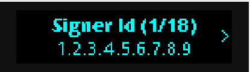
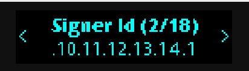
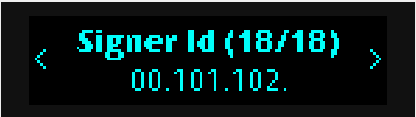
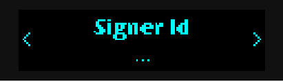
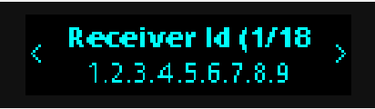
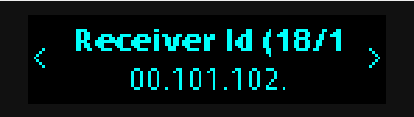
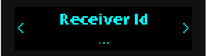
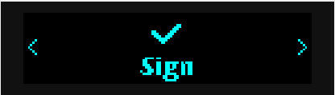

## Successful cases

### Case 1 (1 transfer action, parsed after header review):

For following transaction with [tested larger buffers](https://github.com/dj8yfo/app-near-rs/blob/master/src/parsing/types/transaction_prefix/mod.rs#L16-L17): 

```bash
[2024-01-09T18:14:52Z INFO  sign_transaction::common] ---
[2024-01-09T18:14:52Z INFO  sign_transaction::common] Transaction:
[2024-01-09T18:14:52Z INFO  sign_transaction::common] Transaction {
        signer_id: AccountId(
            "1.2.3.4.5.6.7.8.9.10.11.12.13.14.15.16.17.18.19.20.21.22.23.24.25.26.27.28.29.30.31.32.33.34.35.36.37.38.39.40.41.42.43.44.45.46.47.48.49.50.51.52.53.54.55.56.57.58.59.60.61.62.63.64.65.66.67.68.69.70.71.72.73.74.75.76.77.78.79.80.81.82.83.84.85.86.87.88.89.90.91.92.93.94.95.96.97.98.99.100.101.102.103.104.105.106.107.108.109.110.111.112.113.114.115.116.117.118.119.120.121.122.123.124.125.126.127.128.129.130.131.132.133.134.135.136.137.138.139.140.141.142.143.144.145.146.147.148.149.150.151.152.153.154.155.156.157.158.159.160.161.162.163.164.165.166.167.168.169.170.171.172.173.174.175.176.177.178.179.180.181.182.183.184.185.186.187.188.189.190.191.192.193.194.195.196.197.198.199.200.201.202.203.204.205.206.207.208.209.210.211.212.213.214.215.216.217.218.219.220.221.222.223.224.225.226.227.228.229.230.231.232.233.234.235.236.237.238.239.240.241.242.243.244.245.246.247.248.249.250.251.252.253.254.255.256.257.258.259.260.261.262.263.264.265.266.267.268.269.270.271.272.273.274.275.276.277.278.279.280.281.282.283.284.285.286.287.288.289.290.291.292.293.294.295.296.297.298.299.300.301.302.303.304.305.306.307.308.309.310.311.312.313.314.315.316.317.318.319.320.321.322.323.324.325.326.327.328.329.330.331.332.333.334.335.336.337.338.339.340.341.342.343.344.345.346.347.348.349.350.351.352.353.354.355.356.357.358.359.360.361.362.363.364.365.366.367.368.369.370.371.372.373.374.375.376.377.378.379.380.381.382.383.384.385.386.387.388.389.390.391.392.393.394.395.396.397.398.399.400\n",
        ),
        public_key: ed25519:9Lab2du3zZg5MrZPJCAd1fka7nHuP9Rgo643d8C8hGiJ,
        nonce: 103595482000005,
        receiver_id: AccountId(
            "1.2.3.4.5.6.7.8.9.10.11.12.13.14.15.16.17.18.19.20.21.22.23.24.25.26.27.28.29.30.31.32.33.34.35.36.37.38.39.40.41.42.43.44.45.46.47.48.49.50.51.52.53.54.55.56.57.58.59.60.61.62.63.64.65.66.67.68.69.70.71.72.73.74.75.76.77.78.79.80.81.82.83.84.85.86.87.88.89.90.91.92.93.94.95.96.97.98.99.100.101.102.103.104.105.106.107.108.109.110.111.112.113.114.115.116.117.118.119.120.121.122.123.124.125.126.127.128.129.130.131.132.133.134.135.136.137.138.139.140.141.142.143.144.145.146.147.148.149.150.151.152.153.154.155.156.157.158.159.160.161.162.163.164.165.166.167.168.169.170.171.172.173.174.175.176.177.178.179.180.181.182.183.184.185.186.187.188.189.190.191.192.193.194.195.196.197.198.199.200.201.202.203.204.205.206.207.208.209.210.211.212.213.214.215.216.217.218.219.220.221.222.223.224.225.226.227.228.229.230.231.232.233.234.235.236.237.238.239.240.241.242.243.244.245.246.247.248.249.250.251.252.253.254.255.256.257.258.259.260.261.262.263.264.265.266.267.268.269.270.271.272.273.274.275.276.277.278.279.280.281.282.283.284.285.286.287.288.289.290.291.292.293.294.295.296.297.298.299.300.301.302.303.304.305.306.307.308.309.310.311.312.313.314.315.316.317.318.319.320.321.322.323.324.325.326.327.328.329.330.331.332.333.334.335.336.337.338.339.340.341.342.343.344.345.346.347.348.349.350.351.352.353.354.355.356.357.358.359.360.361.362.363.364.365.366.367.368.369.370.371.372.373.374.375.376.377.378.379.380.381.382.383.384.385.386.387.388.389.390.391.392.393.394.395.396.397.398.399.400\n",
        ),
        block_hash: Cb3vKNiF3MUuVoqfjuEFCgSNPT79pbuVfXXd2RxDXc5E,
        actions: [
            Transfer(
                TransferAction {
                    deposit: 150000000000000000000000,
                },
            ),
        ],
    }
[2024-01-09T18:14:52Z INFO  sign_transaction::common] transaction byte array length: 3086
[2024-01-09T18:14:52Z INFO  sign_transaction::common] ---
```





...





...








### Case 2 (1 MB size transaction):

1 MB size transaction flows through the device for around 7 minutes, if 
the [chunk size](https://github.com/khorolets/near-ledger-rs/blob/main/src/lib.rs#L19) is increased twofold to `255`,
otherwise it takes twice as long.

```bash
[2024-01-03T17:44:31Z INFO  sign_transaction::common] hex        : 6d72c0332649f2f840dd9fb41c90f3e5ff582c6a7343e8b77b72f7df22a65615
[2024-01-03T17:44:31Z INFO  sign_transaction::common] base58     : ed25519:8NEvfU5Nn9TMAYjKXY2SjWdMkbU68BXkRs7JghYcnAWg
[2024-01-03T17:44:31Z INFO  sign_transaction::common] ---
[2024-01-03T17:44:31Z INFO  sign_transaction::common] ---
[2024-01-03T17:44:31Z INFO  sign_transaction::common] Transaction:
[2024-01-03T17:44:31Z INFO  sign_transaction::common] transaction byte array length: 1020213
[2024-01-03T17:44:31Z INFO  sign_transaction::common] ---
[2024-01-03T17:51:36Z INFO  sign_transaction] received response (hex)        : 18afc45d456de50578447a6b6fd19ef6d4f1b201727e04e59233fa1ce75c3e38146c30b188c5f7b260c232faa4b4a140dffb7abc86ec87f200c6f4a8d75f0c05
[2024-01-03T17:51:36Z INFO  sign_transaction::common] ---
[2024-01-03T17:51:36Z INFO  sign_transaction::common] Signature:
[2024-01-03T17:51:36Z INFO  sign_transaction::common] tx hash (hex)        : 0b4f9b0852a3a51ae3cbd0c1502721878b36d561bf2e57ed8438ca738a624422
[2024-01-03T17:51:36Z INFO  sign_transaction::common] signature (hex)      : 18AFC45D456DE50578447A6B6FD19EF6D4F1B201727E04E59233FA1CE75C3E38146C30B188C5F7B260C232FAA4B4A140DFFB7ABC86EC87F200C6F4A8D75F0C05
[2024-01-03T17:51:36Z INFO  sign_transaction::common] signature (base58)   : ed25519:VdMG61q4a6Loxto5wkJSsXWQXhoGLbwMPSY6dnBwgvkJzSqqFcWWWroAMQAUkuPPk2ExgeLZPBFoMyoTCS29iCL
[2024-01-03T17:51:36Z INFO  sign_transaction::common] ---
```

### Case 3 (batch transaction with 27 transfers, overflowing 650 bytes)

Next data chunks are sent by client while user reviews actions (next chunk isn't sent until user
navigates ui to continue at certain points).

```bash
[2024-01-10T20:49:23Z INFO  sign_transaction::common] ---
[2024-01-10T20:49:23Z INFO  sign_transaction::common] Transaction:
[2024-01-10T20:49:23Z INFO  sign_transaction::common] Transaction {
        signer_id: AccountId(
            "1b11b3b31673033936ad07bddc01f9da27d974811e480fb197c799e23480a489",
        ),
        public_key: ed25519:2pffV8fXgXUyuKdTS8Nqnvbkua16wEtTv8tdWZCpVtat,
        nonce: 103595482000005,
        receiver_id: AccountId(
            "dc7e34eecec3096a4a661e10932834f801149c49dba9b93322f6d9de18047f9c",
        ),
        block_hash: Cb3vKNiF3MUuVoqfjuEFCgSNPT79pbuVfXXd2RxDXc5E,
        actions: [
            Transfer(
                TransferAction {
                    deposit: 0,
                },
            ),
            Transfer(
                TransferAction {
                    deposit: 150000000000000000000000,
                },
            ),
            ...
            ...
            Transfer(
                TransferAction {
                    deposit: 3900000000000000000000000,
                },
            ),
        ],
    }
[2024-01-10T20:49:23Z INFO  sign_transaction::common] transaction byte array length: 672
[2024-01-10T20:49:23Z INFO  sign_transaction::common] ---
```


## [Encountered issues/blockers](./mds/issues.md)

## [Platform support](./mds/platforms.md)

## [Binary sizes](./mds/binary_sizes.md)

## [Memory layout](./mds/memory_layout.md)

## [issues with `borsh` usage](./mds/borsh_usage.md)

