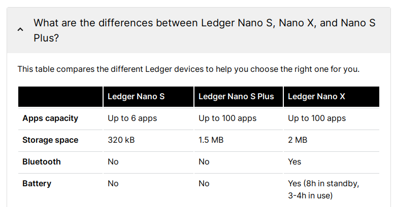

# nanos


```bash

> ledgerctl meminfo # before
Memory usage:
- System: 181.8KB (56.84%)
- Applications: 0.0B (0.00%)
- Available space: 138.0KB (43.16%)
                                                                                                                                                                           
Installed apps: 0 (max: 30)

> ledgerctl meminfo # after
Memory usage:
- System: 181.8KB (56.84%)
- Applications: 30.0KB (9.38%)
- Available space: 108.0KB (33.78%)
                                                                                                                                                                         
Installed apps: 1 (max: 30)

❯ du -B1 target/nanos/release/app*
86016   target/nanos/release/app.hex
151552  target/nanos/release/app-near-rust
65536   target/nanos/release/app-near-rust.apdu
4096    target/nanos/release/app-near-rust.d
```

vs 

```bash

> ledgerctl meminfo  # before
Memory usage:
- System: 181.8KB (56.84%)
- Applications: 0.0B (0.00%)
- Available space: 138.0KB (43.16%)

Installed apps: 0 (max: 30)

> ledgerctl meminfo # after
Memory usage:
- System: 181.8KB (56.84%)
- Applications: 24.0KB (7.51%)
- Available space: 114.0KB (35.65%)
                                                                                                                                                                           
Installed apps: 1 (max: 30)


❯ du -B1 workdir/app-near/build/nanos/bin/*
53248   workdir/app-near/build/nanos/bin/app.apdu
77824   workdir/app-near/build/nanos/bin/app.elf
69632   workdir/app-near/build/nanos/bin/app.hex
4096    workdir/app-near/build/nanos/bin/app.sha256
```

# nanosplus

```bash
❯ du -B1 target/nanosplus/release/app*
90112   target/nanosplus/release/app.hex
155648  target/nanosplus/release/app-near-rust
69632   target/nanosplus/release/app-near-rust.apdu
4096    target/nanosplus/release/app-near-rust.d
```

vs

```bash
❯ du -B1 workdir/app-near/build/nanos2/bin/*
69632   workdir/app-near/build/nanos2/bin/app.apdu
163840  workdir/app-near/build/nanos2/bin/app.elf
94208   workdir/app-near/build/nanos2/bin/app.hex
4096    workdir/app-near/build/nanos2/bin/app.sha256
```

# nanox

```bash
❯ du -B1 target/nanox/release/app*
114688  target/nanox/release/app.hex
266240  target/nanox/release/app-near-rust
86016   target/nanox/release/app-near-rust.apdu
4096    target/nanox/release/app-near-rust.d
```

vs 

```bash
❯ du -B1 workdir/app-near/build/nanox/bin/*
86016   workdir/app-near/build/nanox/bin/app.apdu
167936  workdir/app-near/build/nanox/bin/app.elf
114688  workdir/app-near/build/nanox/bin/app.hex
4096    workdir/app-near/build/nanox/bin/app.sha256
```




